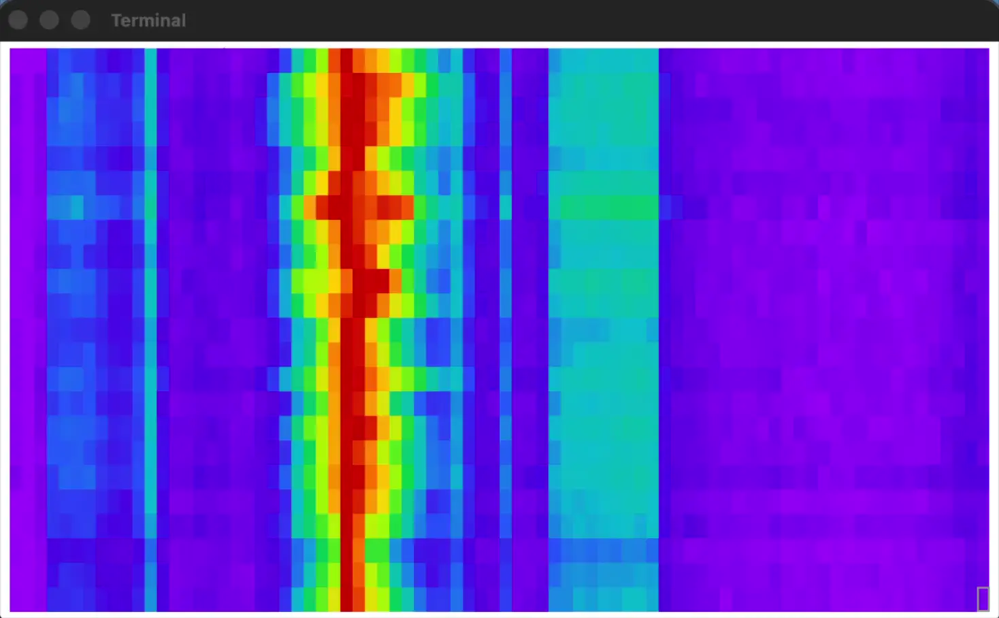

## ttywaterfall.py



### Description

This repo provides a simple tty-console based SDR waterfall viewer for watching unsigned 8-bit IQ TCP streams, such as off the rtl\_tcp server.  It is written in python.  The script ttywaterfall.py only requires that the python library numpy be installed to run.  The viewer cannot control a remote radio.  It can only view its output.  I wanted it to be minimal and debuggable.  The FFT frame size is set by the width of the screen plus a crop factor in the code.  The waterfall colors are automatically adjusted for full dynamic range.  The --step option sets the number of FFT frames averaged before being displayed.  The code requires that your terminal support truecolor escapes.  This is normally accomplished by setting 'export COLORTERM=truecolor' in your .bashrc.  Try first outside of gnu screen.  The use case of this tool is for sshing into your radios and checking reception without having to stream to the network.

### Usage

```
usage: ttywaterfall.py [-h] [--step STEP] [--host HOST] [--port PORT]

options:
  -h, --help   show this help message and exit
  --step STEP  step (default: 1024)
  --host HOST  server host (default: 127.0.0.1)
  --port PORT  server port (default: 1234)
```

